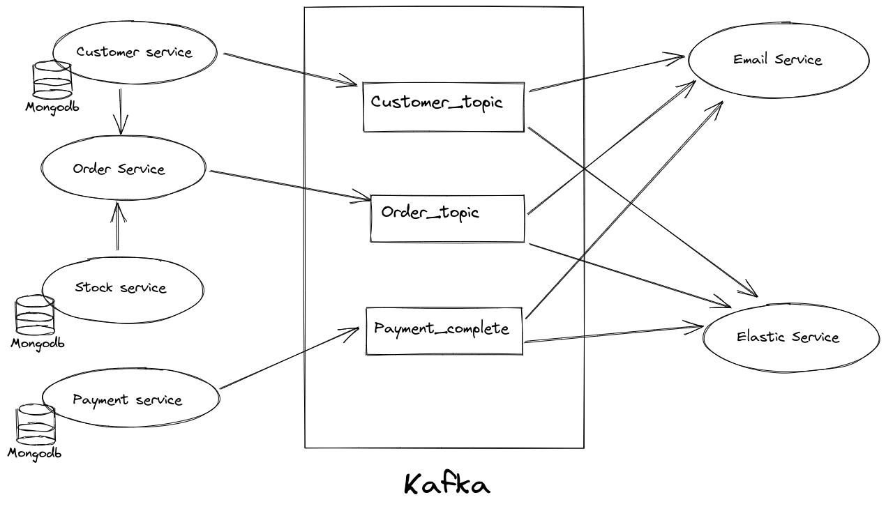

# Ecommerce-ordering service

It is an end-to-end microservice architecture for ordering products

## Installation

Run the docker file to run the background dependencies

```bash
docker-composer up
```

## Architecture

